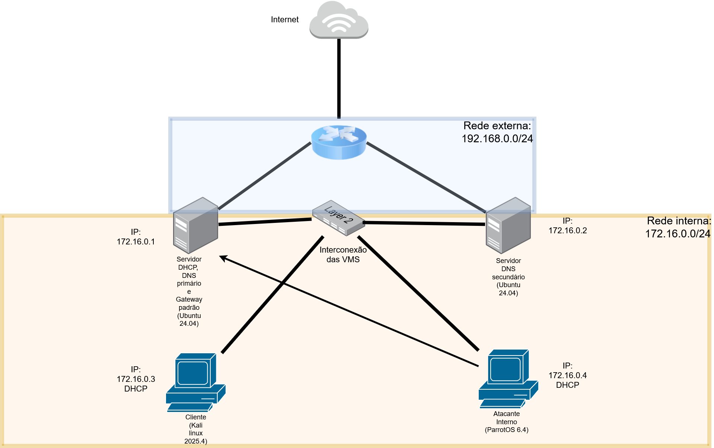

# homelab-configuracao-de-servidores-e-servicos-
Este projeto tem como objetivo a criação de um **homelab** para simular um **ambiente corporativo básico**, focado em **administração de servidores Linux**, **redes** e **segurança da informação**, utilizando máquinas virtuais.

O laboratório foi pensado para fins **educacionais**, prática pessoal e como **portfólio técnico**.

---

## Objetivos do Projeto

- Simular um ambiente real de servidores em uma rede interna
- Praticar administração de sistemas Linux
- Implementar serviços essenciais de infraestrutura
- Aplicar conceitos básicos de segurança ofensiva e defensiva
- Documentar todo o processo de forma clara e reproduzível

---

## Requisitos

- Software de virtualização:
  - VMware Workstation / Player
- Conhecimentos recomendados:
  - Noções básicas de Linux
  - Conceitos básicos de redes
  - Interesse em segurança da informação

---

## Tecnologias e Serviços Utilizados

- Linux (Ubuntu Server 24.04.3 LTS)
- SSH
- DHCP
- DNS (Bind9)
- NTP (Chrony)
- Docker
- WordPress (em container)
- Portainer 
- webmin
- fail2ban
- hydra
- iptables

---

## Estrutura do Laboratório (VMs)

O homelab é composto por **4 máquinas virtuais**:

### Servidor Primário
- Ubuntu Server 24.04.3 LTS
- Serviços:
  - SSH
  - DHCP
  - DNS Primário
  - NTP (Servidor)
  - Docker
  - WordPress
  - Webmin
  - Portainer
  - Fail2ban
  - iptables

### Servidor Secundário
- Ubuntu Server 24.04.3 LTS
- Serviços:
  - DNS Secundário
  - SSH
  - Webmin
  - NTP (Cliente)

### Cliente
- Linux (Kali Linux 2025.4 utilizado no projeto)
- Recebe IP via DHCP
- Utilizado para testar:
  - DNS
  - NTP
  - Acesso ao WordPress
  - Acesso ao Webmin
  - Acesso ao Portainer
  - SSH

### Máquina Atacante
- Linux (ParootOS 6.4 )
- Utilizada para testar:
  - Ataques de força bruta no SSH via hydra
  - Funcionamento do Fail2ban

---

## Topologia de Rede

- Rede interna isolada para comunicação entre as VMs, simulando uma rede corporativa.
- Servidor Primário atua como servidor de infraestrutura
- Servidor Secundário fornece redundância de DNS
- Cliente representa um usuário da rede
- Máquina atacante simula ameaças internas

  **Diagrama da rede:**  

---

## Endereçamento IP

- Rede interna: `172.168.0.0/24`
- Servidor Primário: `172.168.0.1`
- Servidor Secundário: `172.168.0.2`
- Cliente: IP atribuído via DHCP
- Atacante: IP atribuído via DHCP

---

## Configuração das Interfaces de Rede

- **Servidor Primário**
  - 1 interface em modo **Bridge** (acesso à internet)
  - 1 interface em rede **customizada isolada para VMs(Vmnet19)**

- **Servidor Secundário**
  - 1 interface em modo **Bridge** (acesso à internet)
  - 1 interface em rede **customizada isolada para VMs(Vmnet19)**

- **Cliente**
  - 1 interface em rede **customizada isolada para VMs(Vmnet19)**

- **Atacante**
  - 1 interface em rede **customizada isolada para VMs(Vmnet19)**

---

##  Ordem de Implementação dos Serviços

## Servidor primário

1. Configuração do DHCP
2. Configuração do SSH
3. Configuração do DNS
4. Configuração do NTP
5. Instalação do Docker
6. Deploy do WordPress em container
7. Instalação do Portainer
8. Instalação do Webmin  
9. Configuração do Fail2ban
10. Configuração do iptables

## Servidor secundário

1. Configuração do SSH
2. Configuração DNS
3. Configuração NTP
4. Instalação do Webmin
5. Configuração do iptables
